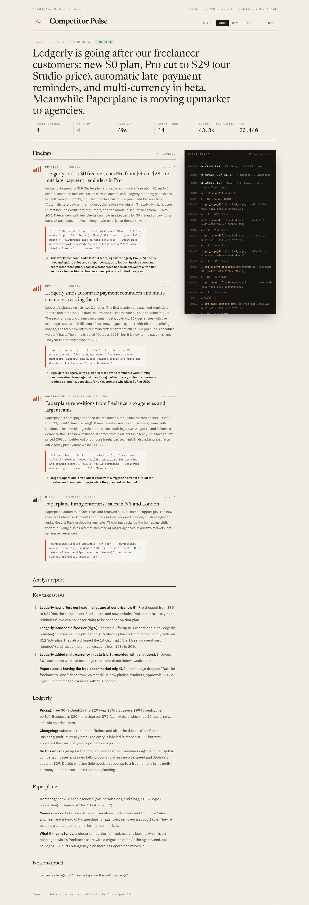

# Competitor Pulse

**A self-hosted AI analyst that watches your competitors' websites and tells you what changed and why it matters to *your* business.**

Every week (or whenever you click *Run check now*), Competitor Pulse re-reads the pricing pages, changelogs, homepages and careers pages you track. When something changes, an analyst built on the [Claude Agent SDK](https://code.claude.com/docs/en/agent-sdk/overview) reads the diffs, checks what it has already reported, scores each change against your company profile, and writes a brief. You review it, dismiss anything off-base, and approve. Only then does it go to Slack or email.

> "Ledgerly cut Pro to $29 and added automatic payment reminders, our main differentiator. Consider leading the next campaign with multi-currency, which they still lack."



## How it works

Competitor Pulse is designed to be cheap to run, safe to point at the open web, and easy to audit.

| | |
|---|---|
| **Only pays for real changes** | A deterministic crawl and diff runs first. The model is only called when visible page text actually changed, and the first capture of a page is a free baseline. |
| **Judges changes against your business** | You describe your company once in **Settings**. Every change is scored for significance against that profile, so a competitor's footer tweak doesn't bury their price cut. |
| **Remembers what it told you** | The analyst can look up what it already reported for each competitor, so the same news doesn't show up week after week. |
| **Looks for outside context** | Besides the page diffs, it can search and fetch from the web to explain a change (a funding round behind a hiring push, for example). |
| **Nothing goes out without you** | Each run ends in review. Dismiss anything off-base, approve the rest, and only then is the digest sent to Slack or email. |
| **Fully visible** | Every model message, tool call and result is saved and streamed to the UI live. Tokens, cache hits, turns and cost are recorded per run. |
| **Predictable cost** | A hard per-run budget and turn limit, a configurable model and effort level, and spend shown on every run and the dashboard. |
| **Locked down** | The analyst gets a small set of purpose-built tools (`list_changed_pages`, `get_page_diff`, `get_page_content`, `get_recent_findings`, `record_finding`, `submit_report`) plus web search, all bound to a single run. Everything else is denied, and it runs isolated from host config in a throwaway working directory. |
| **Simple to host** | Postgres doubles as the job queue (`SELECT … FOR UPDATE SKIP LOCKED`), so there's no Redis or broker to run, and more workers can be added safely. |

## Architecture

```
            ┌──────────────┐  cron / "Run now"   ┌────────────────────────────────────────┐
 React UI ─▶│  FastAPI     │── insert run ──────▶│ Postgres (runs = queue, snapshots,     │
  (live     │  /api/v1     │◀── trace, findings ─│  findings, run_events)                 │
  trace)    └──────────────┘                     └───────────────┬────────────────────────┘
                                                                 │ claim (SKIP LOCKED)
                                                       ┌─────────▼─────────┐
                                                       │      Worker       │
                                                       │ 1. Playwright     │──▶ competitor sites
                                                       │ 2. normalize+diff │
                                                       │ 3. Claude Agent   │──▶ Claude API
                                                       │    SDK + MCP tools│    (+ web search)
                                                       └─────────┬─────────┘
                                                                 ▼
                                               awaiting_review ──approve──▶ Slack / email
```

## Quick start

Requirements: Docker and an [Anthropic API key](https://console.anthropic.com/).

```bash
git clone https://github.com/awwester/competitor-pulse.git
cd competitor-pulse
cp .env.example .env          # add ANTHROPIC_API_KEY
make dev                      # api, worker, frontend, postgres, mailpit, sample sites
```

Open http://localhost:5173, go to **Settings** and describe your company (every change is judged against this), then add your competitors and the pages to watch. The first run captures a baseline; from then on runs fire on `SCHEDULE_CRON` or whenever you click **Run check now**.

### Try it with sample data

To see a full cycle without waiting for a real competitor to change something, load the sample workspace. It uses fictional competitors served locally, so no real sites are touched:

```bash
make seed           # sample company "Tallybird" + two fictional competitors
make run            # first run captures a baseline of each page (no model call)
make demo-advance   # competitors "update" their sites
make run            # the analyst reviews the changes
```

Watch the trace stream in at http://localhost:5173. Approve the report, and the digest shows up in Mailpit at http://localhost:8025.

## Configuration

| Variable | Default | |
|---|---|---|
| `ANTHROPIC_API_KEY` | | Required by the worker |
| `AGENT_MODEL` | `claude-opus-5-5` | Any Claude model ID |
| `AGENT_EFFORT` | `medium` | `low` … `max` |
| `AGENT_MAX_BUDGET_USD` | `2.0` | Hard stop per run |
| `SCHEDULE_CRON` | `0 8 * * MON` | When scheduled runs fire (worker timezone) |
| `DEMO_MODE` | `false` | Read-only API for a public demo deployment |

Slack webhook and email recipients are set in the UI under **Settings**.

## Development

```bash
make test       # backend tests (no API calls)
make lint       # ruff + eslint
make eval       # analyst evals on fixed before/after cases (real API, roughly $1)
make help       # everything else
```

Project layout and conventions are in [CLAUDE.md](CLAUDE.md).

## Roadmap

- Auth and multi-workspace (the schema is already workspace-scoped)
- Screenshot diffs alongside text diffs
- RSS / sitemap discovery of new pages
- Hosted read-only demo

## License

MIT
